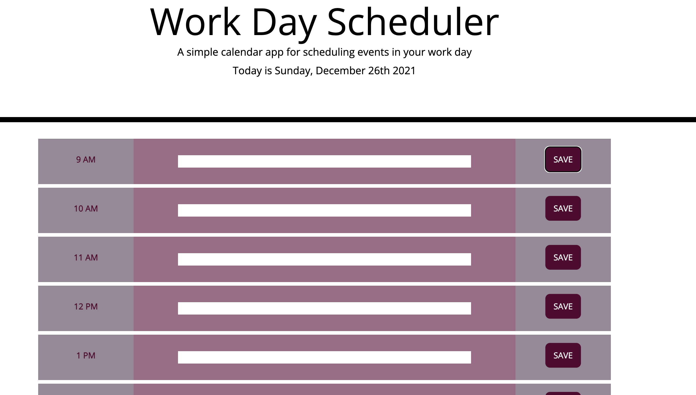

# Work Day Scheduler
In order to manage time effectively with a busy schedule and add important events to a daily planner.

I have created this simple calendar application that allows users to save events for each hour of the day. 

The page structure and styling was provided in the starter code which can be found <a href="https://github.com/coding-boot-camp/super-disco">here</a>. 

Events can be saved to local storage, and will persist even if the page is closed and reopened. 

Events are also color coded based on if the given hour is in the past, present, or future.

Deployed site is viewable at <a href="https://daliamfarag.github.io/Work-Day-Scheduler/">here</a>. Enjoy!

***

 

